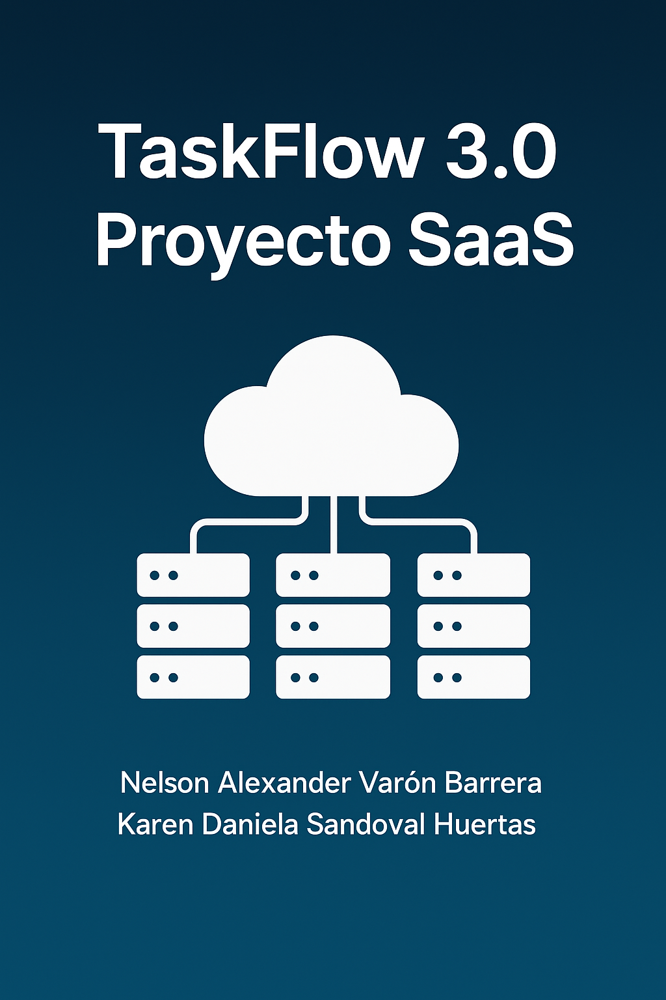

# TaskFlow 3.0 - Proyecto SaaS

TaskFlow 3.0 es una plataforma SaaS diseñada para optimizar la gestión de flujos de trabajo empresariales, combinando servicios cloud de AWS con un modelo de negocio de suscripción escalable.

## Autores
- Nelson Alexander Varón Barrera
- Karen Daniela Sandoval Huertas

## Estructura del repositorio

- `/docs` → Documentación técnica y legal.
- `/src` → Código fuente del prototipo (si aplica).
- `/presentacion` → Slides y documentos de entrega.
- `README.md` → Introducción general al proyecto.

## Tecnologías utilizadas

- AWS (EC2, S3, IAM, Lambda, VPC)
- Modelo SaaS (Freemium + Suscripción)
- Lean Startup
- ISO/IEC 27017 & Ley 1581 de 2012

## Instrucciones

Este proyecto es una simulación académica. No requiere instalación de dependencias.

## Enlace a presentación

[Próximamente: enlace a Gamma AI o PDF]

---
